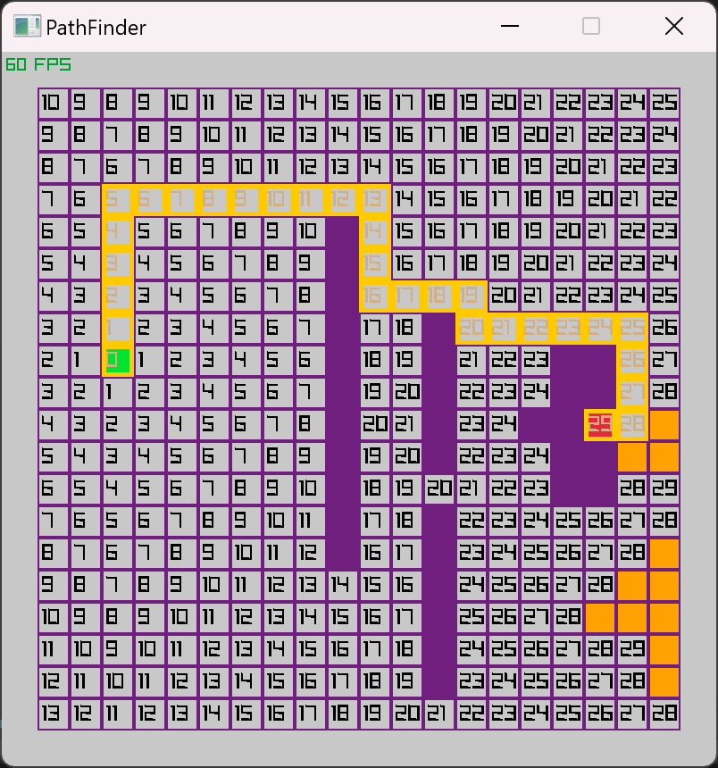

# **Path Finder: the Dijkstra algorithm using RUST**

Started on 9/04/2024.

This is based on the Youtube video from CodeScope:

https://www.youtube.com/watch?v=vid9KO6Evro

The original project is in C and uses the Raylib lib.

Adapted/(Translated) to RUST using the Raylib-RUST lib.

This is an adaptation of the "famous" Dijkstra algorithm for shortest path finder.
For this project the "map" is a 2D grid  but the original algorithm can solve oriented/weighted graph.




How to run it
```linux
cargo run
````

* Key F for fast forward the steps.

* Key S for step (1 step at a time).

* Key P to reveal path (only if the steps have reach the destination).

* Key 1 to change the start position on the grid.
* Key 2 to change the destination position on the grid.